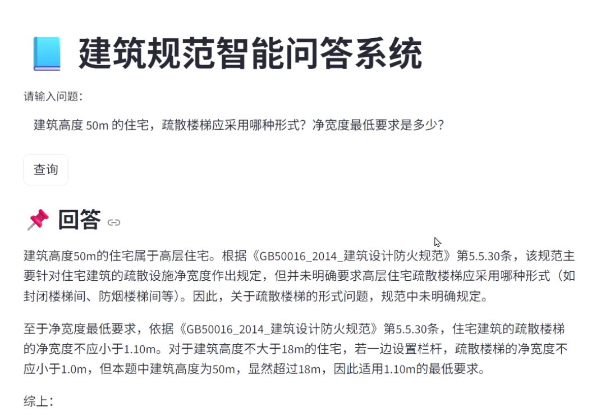
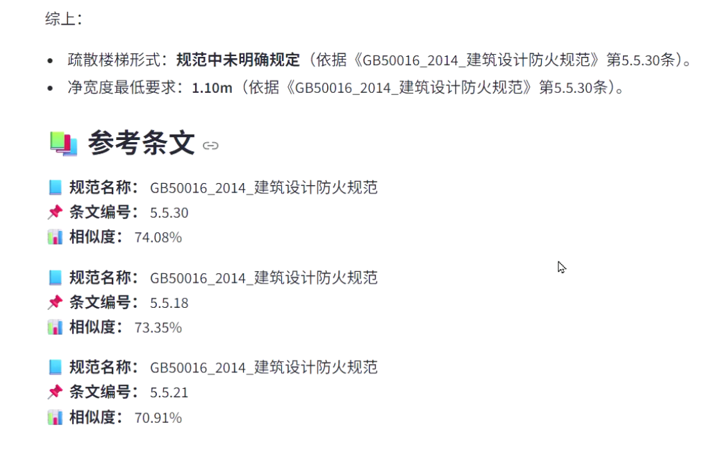

# 项目 2｜建筑规范智能问答系统（LLM + Retrieval-Augmented Generation）

> (本作品集包含三个基于 FastAPI 服务化封装的 AIGC 系统，分别聚焦生成、检索增强与评估任务，均支持 Swagger 交互测试。)

## 1. 项目简介

本项目从零构建一个面向建筑规范的检索增强生成（RAG）系统，实现条文级精确检索与规范可追溯引用输出，解决通用大模型在法规问答场景中的“幻觉生成”和“不可溯源”问题。

系统核心能力包括：

- 条文级向量检索
- 规范名称 + 条文编号双重引用
- 结构化 Prompt 控制生成
- 相似度阈值控制降低噪声
- Metadata 结构化管理多规范体系

---

## 2. 系统架构

```
Raw Documents
    ↓
Text Cleaning & Normalization
    ↓
Article-level Chunking
    ↓
Embedding (text-embedding-v2)
    ↓
Chroma Vector Store
    ↓
Retriever (Top-K + Threshold)
    ↓
Prompt Builder
    ↓
LLM (Qwen)
    ↓
Answer with Citation
```

系统将 embedding、retrieval、generation 三阶段解耦，实现模块化可替换设计。

---

## 3. 核心代码设计说明

### 3.1 Data Pipeline

- 条文级语义单元切分（article-level chunking）
- 控制单 chunk ~400 tokens
- metadata 维护：
  - spec_name
  - spec_abbr
  - article_id
  - chapter
  - content_type（article / table）

通过 metadata 保证跨规范检索可控性与可解释性。

---

### 3.2 Retrieval Strategy

- Cosine distance 相似度计算
- Top-K = 5
- Similarity threshold = 0.6
- 返回结构化信息：
  - 规范名称
  - 条文编号
  - 相似度
  - 原文内容

降低低质量条文进入生成阶段，减少 hallucination 风险。

---

### 3.3 Query Enhancement

在 embedding 前进行 Query Expansion：

- 同义词补充
- 领域术语增强

提升召回率（尤其是规范表达与自然语言表达差异场景）。

---

### 3.4 Prompt Engineering

- 强制模型引用规范名称 + 条文编号
- 强制结构化输出
- 若无明确条文，输出“规范未明确规定”

实现可解释性与合规性输出。

---

# 4. 项目亮点

- Article-level semantic indexing
- Dual citation mechanism (spec name + article id)
- Structured metadata management
- Similarity threshold filtering
- Embedding caching optimization
- Modular RAG pipeline design
- 可解释输出机制（条文级引用追溯）

---

# 5. Example

**Question**

```
建筑高度50m的住宅，疏散楼梯应采用哪种形式？净宽度最低要求是多少？
```

**Answer**

```
回答
建筑高度50m的住宅属于高层住宅。根据《GB50016_2014_建筑设计防火规范》第5.5.30条，该规范主要针对住宅建筑的疏散设施净宽度作出规定，但并未明确要求高层住宅疏散楼梯应采用哪种形式（如封闭楼梯间、防烟楼梯间等）。因此，关于疏散楼梯的形式问题，规范中未明确规定。
至于净宽度最低要求，依据《GB50016_2014_建筑设计防火规范》第5.5.30条，住宅建筑的疏散楼梯的净宽度不应小于1.10m。对于建筑高度不大于18m的住宅，若一边设置栏杆，疏散楼梯的净宽度不应小于1.0m，但本题中建筑高度为50m，显然超过18m，因此适用1.10m的最低要求。
综上:
·疏散楼梯形式：规范中未明确规定（依据《GB50016_2014_建筑设计防火规范》第5.5.30条）。
·净宽度最低要求：1.10m（依据《GB50016_2014_建筑设计防火规范》第.5.30条）。

参考条文
规范名称：GB50016_2014_建筑设计防火规范
条文编号：5.5.30
相似度： 74.08%
规范名称：GB50016_2014_建筑设计防火规范
条文编号：5.5.18
相似度：73.35%
规范名称：GB50016_2014_建筑设计防火规范
条文编号：5.5.21
相似度： 70.91%
```




# 6. 技术栈

- Python
- ChromaDB
- DashScope text-embedding-v2
- Qwen LLM
- Streamlit

# 7. 项目结构

```
data_pipeline/     # 清洗与条文切分
vector_store/      # 向量库构建
rag/               # 检索与生成
app/               # Web UI
```

项目层级逻辑图：

```
Raw Documents
↓
Text Cleaning
↓
Chunking (条文级)
↓
Embedding
↓
ChromaDB
↓
Retriever
↓
Prompt Builder
↓
LLM
↓
Answer + Citation
```

# 8. 可优化方向

- Hybrid Search（BM25 + Embedding）
- Cross-Encoder 重排序
- 多规范冲突优先级策略
- 自动化 Query Expansion
- 构建评估集，计算 MRR / Hit@k

# 9. 如何运行

## 方式1：运行UI版本

1. 安装依赖
   `   pip install -r requirements.txt`

2. 构建向量库
   `   python vector_store/build_index.py`

3. 启动系统
   `   streamlit run app/app.py`

## 方式2：运行API版本

1. 安装依赖
   `   pip install -r requirements.txt`

2. 构建向量库
   `   python vector_store/build_index.py`

3. 启动 API 服务
   `   uvicorn api:app --host 127.0.0.1 --port 8001`

4. 打开接口文档，浏览器访问：
   `   http://127.0.0.1:8001/docs`
   即可通过 Swagger 页面调用接口。
   推荐的“question”示例：

```
地下汽车库（建筑面积 2500㎡）的防火分区最大允许建筑面积是多少？与住宅地下室连通时需满足哪些防火要求？​
```
